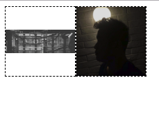

#### 1.利用table实现图片垂直居中
利用table的方法是利用了table的垂直居中属性，代码如下：这里使用display: table;和display: table-cell;来模拟table，这种方法并不兼容IE6/IE7，IE67不支持display: table，如果你不需要支持IE67那就可以用缺点：当你设置了display: table;可能会改变你的原有布局。
```html
<style>
  .demo1 {width: 100px; height: 100px; border: 1px dashed #000; display: table-cell; /*主要是这个属性*/ vertical-align: middle; text-align: center; }
      .demo1 img {width: 100%; }
</style>
<div class="demo1">
  
</div>
<div class="demo1">
  
</div>
```
#### 2.利用行高实现图片垂直居中
```html
<style>
  .demo2{float:left;text-align: center; width: 100px;height:100px; line-height:100px; border: 1px dashed #000; }
        .demo2 img{display: inline-block; vertical-align: middle;width:100%; }
</style>
<div class="demo2">
  
</div>
<div class="demo2">
  
</div>
```
#### 3.利用flex布局实现css图片垂直居中
```html
<style>
  .demo3{float:left;display:flex;border: 1px dashed #000;width:100px;height:100px;align-items: center;}
     .demo3 img{width:100%;}
</style>
<div class="demo3">
  
</div>
<div class="demo3">
  
</div>
```
