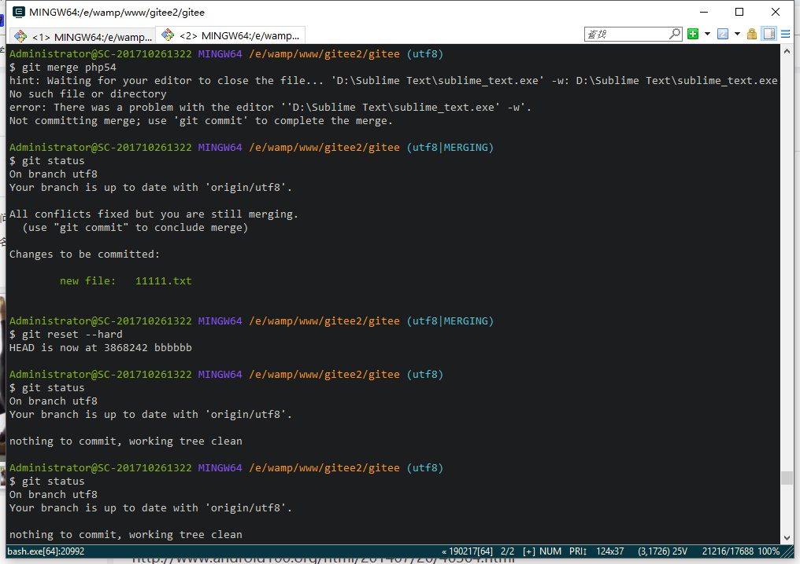
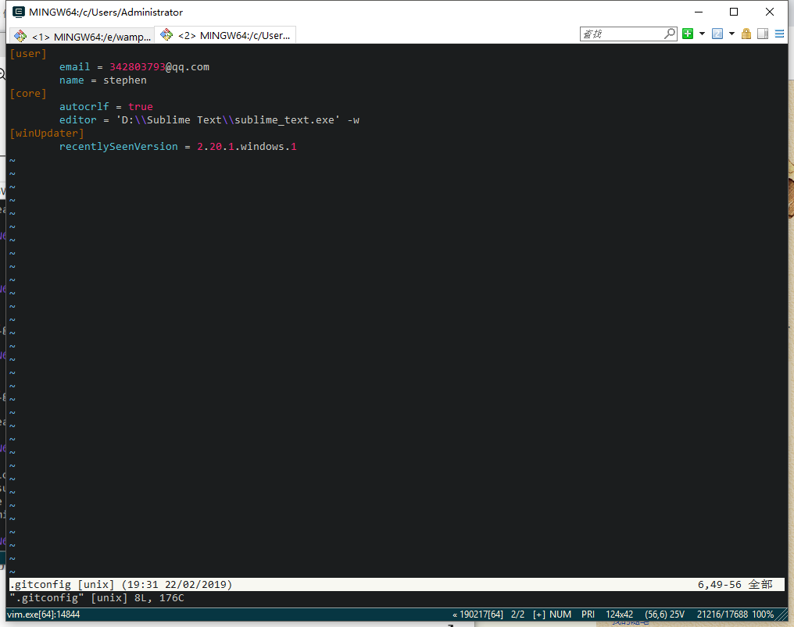
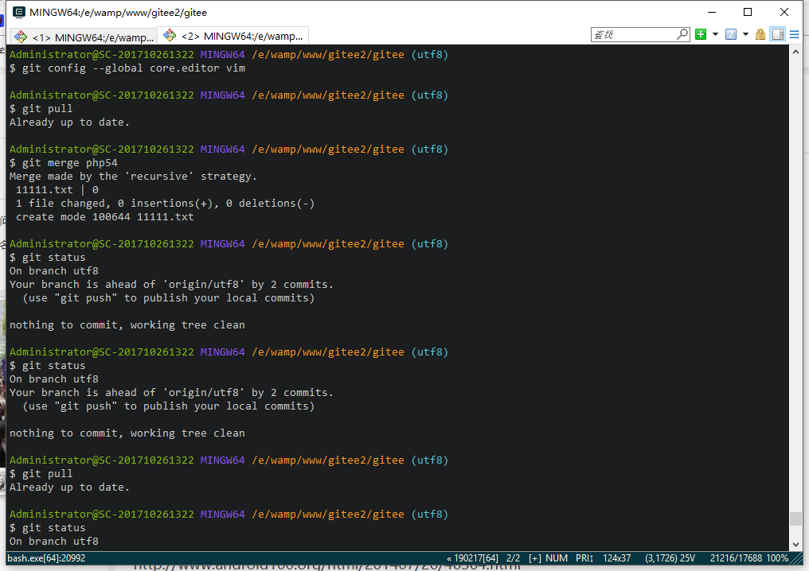
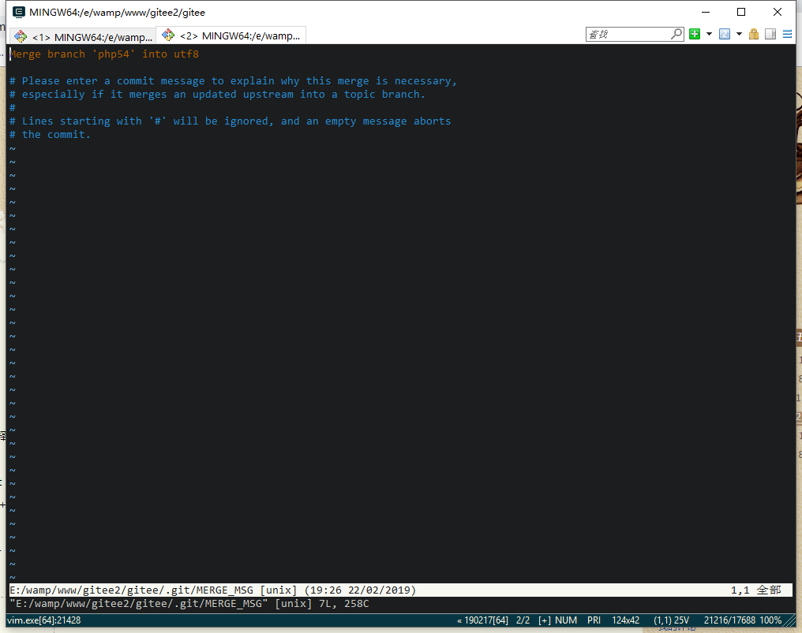

>在使用git开发的过程中，难免会遇到git merge。用来在开发完成后保持和主分支的一致性(保持最新代码)，这样主分支merge你开发分支的时候就会减少不必要的冲突解决。
但我遇到这样一个问题：在自己分支开发完成之后，merge主分支的时候报错：
````bash
hint: Waitiing for your editor to close the file... 'D:\Sublime Text\sublime_text.ext' -w: D:\Sublime Text\sublime_text.exe  No such file or derectory
error: There was a problem with the editor ''D:\Sublime Text\sublime_text.ext' -w'.
Not committing merge; use 'git commit' to complete the merge.
````
问题复现一下，如下图。utf8分支作为我的开发分支，php54作为主分支。

由图可见merge php54分支的时候不但没合并成功，还多了一个new file。这个new file是别人在php54分支上开发的代码，这尼玛是什么鬼啊？

git提示我们使用"git commit"去完成合并，Ps:在这里用git commit是没有问题的。只不过会多一次commit记录。

但是你想想，如果我们在php54分支上再次merge utf8，又会出现这样的问题。(报错，并且多出utf8下开发的代码)，需要你手动commit。如果文件修改多了，这样反反复复commit操作，会导致你commit的文件里有存在冲突而没有修改的情况。

这里执行
````bash
git reset --hard //回退版本
````
看了下D盘，确实没有Sublime Text目录，而是有Sublime Text3目录，可能是我装Sublime Text的时候卸载过，又重新装了新版的Sublime。
````bash
vim ~/.gitconfig
````

这里的global core.editor路径可能有问题
````bash
git config --global core.editor vim //设置vim为git默认编辑器
git merge php54 //再次merge php54
````

AMAZING!!!

原来每次merge都会打开这个editor让你去填写记录名称，而报错只是找不到editor而已，恍然大悟。


