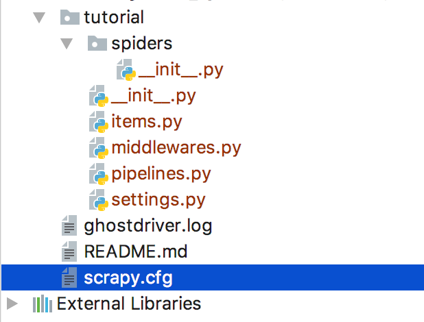

学习scrapy之前，你应该对python有所了解。对于了解Scrapy爬虫框架，可以阅读这部分文章
[Scrapy入门教程](https://scrapy-chs.readthedocs.io/zh_CN/latest/intro/tutorial.html)
[如何入门 Python 爬虫](https://www.zhihu.com/question/20899988)


#### 整体架构


##### 1.Scrapy数据流是由执行的核心引擎(engine)控制，流程是这样的：

##### 2.引擎打开一个域名，蜘蛛处理这个域名，并让蜘蛛获取第一个爬取的URL。

##### 3.引擎从蜘蛛那获取第一个需要爬取的URL，然后作为请求在调度中进行调度。

##### 4.引擎从调度那获取接下来进行爬取的页面。

##### 5.调度将下一个爬取的URL返回给引擎，引擎将他们通过下载中间件发送到下载器。

##### 6.当网页被下载器下载完成以后，响应内容通过下载中间件被发送到引擎。

##### 7.引擎收到下载器的响应并将它通过蜘蛛中间件发送到蜘蛛进行处理。

##### 8.蜘蛛处理响应并返回爬取到的item，然后给引擎发送新的请求。

##### 9.引擎发送处理后的item到项目管道，然后把处理结果返回给调度器，调度器计划处理下一个请求抓取。

##### 10.系统重复2-9的操作，直到调度中没有请求，然后断开引擎与域之间的联系。


## 一、新建scrapy爬虫项目
> scrapy startproject tutorial

生成的目录如下


#### tutorial/items.py【项目】
保存爬取到的数据的容器；其使用方法和python字典类似， 并且提供了额外保护机制来避免拼写错误导致的未定义字段错误。
类似在ORM中做的一样，可以通过创建一个 scrapy.Item 类， 并且定义类型为 scrapy.Field 的类属性来定义一个Item。

#### tutorial/pipelines.py【管道】
当页面被蜘蛛解析后，将被发送到项目管道，用户可以通过管道清洗数据或者插入到数据库中。

#### tutorial/settings.py【设置】
settings.py是Scrapy中比较重要的配置文件，里面可以设置的内容非常之多。比如在pipelines.py中编写了把数据保存到mysql数据的class，那么怎么样才能使得这个class执行呢？就可以在settings设置。还有包括像log日志，log路径等设置。

#### tutorial/spider
该目录下放置爬虫代码

#### tutorial/middlewares.py【中间件】
这块在很后面才会用到，先不介绍。

## 二、编写你的第一个爬虫
以抓取某求职网站的php职位为例

##### 1.items.py里定义数据容器：
```python
# -*- coding: utf-8 -*-

# Define here the models for your scraped items
#
# See documentation in:
# https://docs.scrapy.org/en/latest/topics/items.html

import scrapy


class GoodjobsItem(scrapy.Item):
    # define the fields for your item here like:
    # name = scrapy.Field()
    jobname = scrapy.Field()
```

##### 2.爬虫goodjobs.py:
```python
import scrapy
from goodjobs.items import GoodjobsItem

class Goodjobs(scrapy.spiders.Spider):
    #scrapy名称
    name = "goodjobs"
    allowed_domains = ["goodjobs.cn"]
    base_url = 'https://search.goodjobs.cn'
    start_urls = [
        "https://search.goodjobs.cn/index.php?keyword=php&boxwp=c1043"
    ]

    def parse(self, response):
        for sel in response.xpath('//div[@class="SearchJobList"]'):
	    #这里用的是xpath定位节点，也可以用css()去做。extract是返回数组list
            jobname = sel.xpath('ul//a/@title').extract()
	    #调用数据容器，将渠道的jobname赋值给item。
            item = GoodjobsItem() 
            item['jobname'] = jobname
	    #生成器返回item
            yield item

        next_page_url = self.base_url + response.xpath('//div[@class="p_in"]//a[contains(text(),"下一页")]/@href').extract()[0]
	#返回一个迭代器
        yield scrapy.Request(next_page_url,callback=self.parse)
```
这里不容易理解的地方就是“yield”，我们通过 yield 来发起一个请求，并通过 callback 参数为这个请求添加回调函数，在请求完成之后会将响应作为参数传递给回调函数。

scrapy框架会根据 yield 返回的实例类型来执行不同的操作，如果是 scrapy.Request 对象，scrapy框架会去获得该对象指向的链接并在请求完成后调用该对象的回调函数。

如果是 scrapy.Item 对象，scrapy框架会将这个对象传递给 pipelines.py做进一步处理。

##### 3.pipelines.py 将数据从管道导入到数据库
```python
# -*- coding: utf-8 -*-

# Define your item pipelines here
#
# Don't forget to add your pipeline to the ITEM_PIPELINES setting
# See: https://docs.scrapy.org/en/latest/topics/item-pipeline.html


import pymysql

class GoodjobsPipeline(object):
    def __init__(self):
        #建立数据库连接
        self.connection = pymysql.connect(host='127.0.0.1', port=3306, user='root', password='1234', db='goodjobs',charset='utf8')
        #创建操作游标
        self.cursor = self.connection.cursor()

    def process_item(self, item, spider):
        #定义sql语句
        sql = "INSERT INTO `goodjobs`.`t_jobs` (`jobname`, `corpname`) VALUES ('"+item['jobname'][0]+"', '"+item['jobname'][1]+"');"

        #执行sql语句
        self.cursor.execute(sql)
        #保存修改
        self.connection.commit()

        return item

    def __del__(self):
        #关闭操作游标
        self.cursor.close()
        #关闭数据库连接
        self.connection.close()
```

### 三、执行爬虫
> scrapy crawl goodjobs

[Demo For Goodjobs Spider](https://github.com/zyanfei/goodjobs_spider)

#### 其他要注意的：
Xpath:
Xpath是Selectors选择器的一种，可以很方便的定位到你想要的元素。
XPath的常用匹配规则，例如 / 代表选取直接子节点，// 代表选择所有子孙节点，. 代表选取当前节点，.. 代表选取当前节点的父节点，@ 则是加了属性的限定，选取匹配属性的特定节点。


