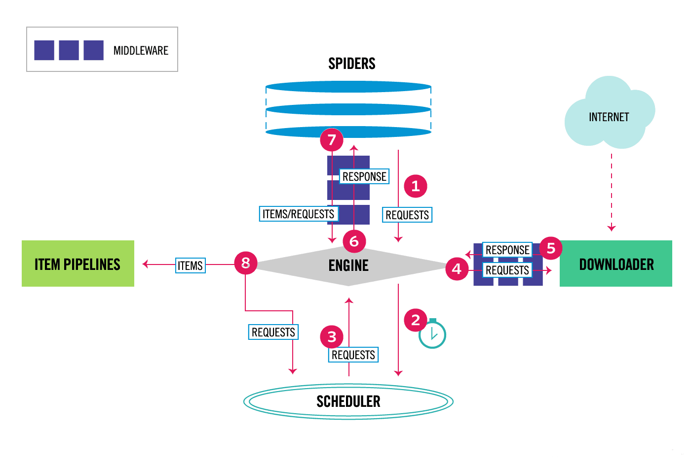

Scrapy是用纯Python实现一个为了爬取网站数据、提取结构性数据而编写的应用框架，用途非常广泛。学习scrapy之前，你应该掌握python基本语法糖。对于了解Scrapy，可以阅读这部分文章
[Scrapy入门教程](https://scrapy-chs.readthedocs.io/zh_CN/latest/intro/tutorial.html)
[如何入门 Python 爬虫](https://www.zhihu.com/question/20899988)

## 一、了解scrapy运作方式
#### scrapy流程图


#### scrapy组件
> Scrapy Engine(引擎): 负责Spider、ItemPipeline、Downloader、Scheduler中间的通讯，信号、数据传递等。

> Scheduler(调度器): 它负责接受引擎发送过来的Request请求，并按照一定的方式进行整理排列，入队，当引擎需要时，交还给引擎。

> Downloader（下载器）：负责下载Scrapy Engine(引擎)发送的所有Requests请求，并将其获取到的Responses交还给Scrapy Engine(引擎)，由引擎交给Spider来处理，

> Spider（爬虫）：它负责处理所有Responses,从中分析提取数据，获取Item字段需要的数据，并将需要跟进的URL提交给引擎，再次进入Scheduler(调度器)，

> Item Pipeline(管道)：它负责处理Spider中获取到的Item，并进行进行后期处理（详细分析、过滤、存储等）的地方.

> Downloader Middlewares（下载中间件）：你可以当作是一个可以自定义扩展下载功能的组件。

> Spider Middlewares（Spider中间件）：你可以理解为是一个可以自定扩展和操作引擎和Spider中间通信的功能组件（比如进入Spider的Responses;和从Spider出去的Requests）

#### scrapy数据流(Data flow)

* 1.引擎打开一个网站(open a domain)，找到处理该网站的Spider并向该spider请求第一个要爬取的URL(s)。
* 2.引擎从Spider中获取到第一个要爬取的URL并在调度器(Scheduler)以Request调度。
* 3.引擎向调度器请求下一个要爬取的URL。
* 4.调度器返回下一个要爬取的URL给引擎，引擎将URL通过下载中间件(请求(request)方向)转发给下载器(Downloader)。
* 5.一旦页面下载完毕，下载器生成一个该页面的Response，并将其通过下载中间件(返回(response)方向)发送给引擎。
* 6.引擎从下载器中接收到Response并通过Spider中间件(输入方向)发送给Spider处理。
* 7.Spider处理Response并返回爬取到的Item及(跟进的)新的Request给引擎。
* 8.引擎将(Spider返回的)爬取到的Item给Item Pipeline，将(Spider返回的)Request给调度器。
* 9.(从第二步)重复直到调度器中没有更多地request，引擎关闭该网站。
引擎获取起始url并发起请求,将获取的响应内容返回给spider,
在spider中进行数据的提取和下一个url的链接,
数据交给item和pipeline进行处理,
url继续发起请求,

编写spider
制作 Scrapy 爬虫 一共需要4步：

新建项目 (scrapy startproject xxx)：新建一个新的爬虫项目
明确目标 （编写items.py）：明确你想要抓取的目标
制作爬虫 （spiders/xxspider.py）：制作爬虫开始爬取网页
存储内容 （pipelines.py）：设计管道存储爬取内容


## 二、编写你的第一个爬虫
以抓取某求职网站的php职位为例

>scrapy startproject goodjobs

##### 1.items.py里定义数据容器：
```python
# -*- coding: utf-8 -*-

# Define here the models for your scraped items
#
# See documentation in:
# https://docs.scrapy.org/en/latest/topics/items.html

import scrapy


class GoodjobsItem(scrapy.Item):
    # define the fields for your item here like:
    # name = scrapy.Field()
    jobname = scrapy.Field()
```

##### 2.爬虫goodjobs.py:
```python
import scrapy
from goodjobs.items import GoodjobsItem

class Goodjobs(scrapy.spiders.Spider):
    #scrapy名称
    name = "goodjobs"
    allowed_domains = ["goodjobs.cn"]
    base_url = 'https://search.goodjobs.cn'
    start_urls = [
        "https://search.goodjobs.cn/index.php?keyword=php&boxwp=c1043"
    ]

    def parse(self, response):
        for sel in response.xpath('//div[@class="SearchJobList"]'):
            #这里用的是xpath定位节点，也可以用css()去做。extract是返回数组list
            jobname = sel.xpath('ul//a/@title').extract()
	    #调用数据容器，将渠道的jobname赋值给item。
            item = GoodjobsItem() 
            item['jobname'] = jobname
	    #yield生成器返回item迭代值，进行下一步next()操作
            yield item

        next_page_url = self.base_url + response.xpath('//div[@class="p_in"]//a[contains(text(),"下一页")]/@href').extract()[0]
	#返回一个迭代器
        yield scrapy.Request(next_page_url,callback=self.parse)
```

##### 3.pipelines.py 管道保存数据
```python
# -*- coding: utf-8 -*-

# Define your item pipelines here
#
# Don't forget to add your pipeline to the ITEM_PIPELINES setting
# See: https://docs.scrapy.org/en/latest/topics/item-pipeline.html


import pymysql

class GoodjobsPipeline(object):
    def __init__(self):
        #建立数据库连接
        self.connection = pymysql.connect(host='127.0.0.1', port=3306, user='root', password='1234', db='goodjobs',charset='utf8')
        #创建操作游标
        self.cursor = self.connection.cursor()

    def process_item(self, item, spider):
        #定义sql语句
        sql = "INSERT INTO `goodjobs`.`t_jobs` (`jobname`, `corpname`) VALUES ('"+item['jobname'][0]+"', '"+item['jobname'][1]+"');"

        #执行sql语句
        self.cursor.execute(sql)
        #保存修改
        self.connection.commit()

        return item

    def __del__(self):
        #关闭操作游标
        self.cursor.close()
        #关闭数据库连接
        self.connection.close()
```
> scrapy crawl goodjobs

##### 如图：


[Demo For Goodjobs Spider](https://github.com/zyanfei/goodjobs_spider)

## 三、最后认识下Selectors选择器
[文档看这里](https://scrapy-chs.readthedocs.io/zh_CN/1.0/topics/selectors.html)
Scrapy Selectors内置XPath和 CSS Selector表达式机制

Selector有四个基本的方法:

xpath(): 传入xpath表达式，返回该表达式所对应的所有节点的selector list列表
extract(): 序列化该节点为Unicode字符串并返回list
css(): 传入CSS表达式，返回该表达式所对应的所有节点的selector list列表，语法同 BeautifulSoup4
re(): 根据传入的正则表达式对数据进行提取，返回Unicode字符串list列表
通过shell可以很方便的提取出需要的数据


